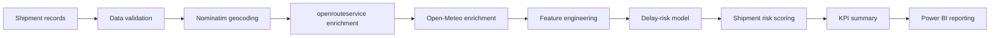

# AI-Based Logistics Management System

> An API-enriched logistics intelligence pipeline for shipment analysis, delay-risk assessment, KPI generation and Power BI reporting.

    

> [!NOTE]
> This repository is an academic decision-support prototype. The data pipeline and reporting workflow are implemented, while the current delay-risk model remains an experimental baseline and is not suitable for production decisions.

## Project Overview

Logistics organisations often have fragmented shipment data and limited contextual information about location, route distance, estimated travel duration, weather, delivery delays, cost efficiency, and operational KPIs. 

This project combines shipment records with external API context and converts them into an analysis-ready dataset for prediction and management reporting.

## Business Questions

- Which shipments show a higher risk of delay?
- Which routes have poor cost or time efficiency?
- How do weather and route conditions affect delivery outcomes?
- Which warehouses, vehicle types or product categories need attention?
- What operational KPIs should managers monitor?

## Key Capabilities

- Synthetic shipment dataset
- Geocoding of origin and destination locations
- Route-distance and travel-time enrichment
- Weather enrichment
- Feature engineering
- Delay-risk model training and scoring
- Pipeline-stage validation
- KPI-summary generation
- Power BI dashboard asset
- Saved model artifact
- Modular pipeline structure

## System Architecture



## Data Pipeline

### Stage 1 — Shipment generation
Generates the base shipment fields and outputs the initial dataset.

### Stage 2 — Geocoding
Converts origin and destination locations into latitude and longitude coordinates.

### Stage 3 — Route enrichment
Fetches route distance and estimated travel duration.

### Stage 4 — Weather enrichment
Gathers temperature, precipitation, wind speed and overall weather context.

### Stage 5 — Feature engineering
Computes verified derived fields such as delay hours, on-time indicator, cost per kilometre, and route-efficiency score.

### Stage 6 — Model and KPI layer
Handles model training, delay-risk scoring of the enriched shipments, KPI generation, and export for Power BI consumption.

For further details, see:
- [Pipeline design](pipeline_design.md)
- [Dataset schema](data_schema.md)
- [API mapping](api_mapping.md)
- [Base dataset design](base_dataset_design.md)

## Model Evaluation

| Metric | Value |
|---|---:|
| Test samples | 150 |
| Accuracy | 0.5733 |
| Delayed-class precision | 0.27 |
| Delayed-class recall | 0.75 |
| Delayed-class F1 | 0.40 |

**Confusion Matrix:**
```text
[[65, 57],
 [ 7, 21]]
```

- The model detects 75% of delayed shipments in the test split.
- Low precision means many on-time shipments are incorrectly flagged as delayed.
- The model prioritises delay recall at the cost of false positives.
- The result is an experimental baseline rather than a production model.
- The dataset is imbalanced.
- The majority-class test baseline is approximately 81.3% accuracy, so raw accuracy alone does not support claiming that the current model is strong.
- Future work must improve precision, calibration and validation.

## Power BI Reporting

The dashboard (`AI BASED LOGISTICS MANAGEMENT SYSTEM.pbix`) is intended to visualise operational KPIs and shipment-level analysis. The `.pbix` file can be opened locally in Power BI Desktop to explore the generated reports.

## Repository Structure

```text
.
├── models/
├── reports/
├── src/
│   ├── features/
│   ├── ingestion/
│   ├── models/
│   ├── preprocessing/
│   └── reporting/
├── AI BASED LOGISTICS MANAGEMENT SYSTEM.pbix
├── api_mapping.md
├── base_dataset_design.md
├── data_schema.md
├── pipeline_design.md
├── project_foundation.md
├── requirements.txt
└── LICENSE
```

## Getting Started

### Clone
```bash
git clone https://github.com/raywincruz07-collab/ai_logistics_management_system.git
cd ai_logistics_management_system
```

### Create environment

Unix/macOS:
```bash
python -m venv .venv
source .venv/bin/activate
python -m pip install -r requirements.txt
python -m pip install scikit-learn joblib
```

Windows PowerShell:
```powershell
python -m venv .venv
.venv\Scripts\Activate.ps1
python -m pip install -r requirements.txt
python -m pip install scikit-learn joblib
```

> `scikit-learn` and `joblib` are currently required by the model workflow but are not listed in the committed `requirements.txt`. They are installed explicitly above until the dependency file is corrected in a separate update.

## Configuration

To run the routing and enrichment pipeline, the `openrouteservice` API requires an access key. Provide it via an environment variable before execution:

```powershell
$env:ORS_API_KEY="your-api-key"
```

The Nominatim and Open-Meteo APIs are utilised without explicit API keys, but may enforce rate limits on usage. 

## Running the Pipeline

Execute the pipeline in the following documented sequence from the repository root:

> The enrichment stages call external APIs and therefore require network access, a valid `ORS_API_KEY`, and compliance with provider rate limits.

```bash
python src/ingestion/generate_shipments.py
python src/preprocessing/validate_shipments.py
python src/ingestion/geocode_locations.py
python src/preprocessing/validate_geocoded_shipments.py
python src/ingestion/route_shipments.py
python src/preprocessing/validate_routed_shipments.py
python src/ingestion/enrich_weather.py
python src/preprocessing/validate_weather_shipments.py
python src/features/engineer_features.py
python src/preprocessing/validate_featured_shipments.py
python src/models/train_delay_model.py
python src/models/score_delay_risk.py
python src/preprocessing/validate_scored_shipments.py
python src/reporting/build_kpi_summary.py
python src/preprocessing/validate_kpi_outputs.py
```

## Outputs

- Enriched shipment datasets
- Feature-engineered model dataset
- Saved delay-risk model
- Scored shipment data
- KPI summary
- Model evaluation report
- Power BI dashboard file

## Limitations

- Dataset is synthetic rather than operational company data
- API availability and rate limits can affect reproducibility
- Current model has low precision for delayed shipments
- Current model underperforms the majority-class baseline on raw accuracy
- Small test set
- No temporal validation
- No production monitoring
- No real-time orchestration
- No deployed application
- No cost-sensitive threshold optimisation documented

## Roadmap

- Improve delay-class precision and F1
- Add stronger baseline and model comparisons
- Add temporal train/test splitting
- Introduce probability calibration
- Tune the decision threshold using business costs
- Add feature-importance or explainability analysis
- Add automated tests
- Add orchestration for the complete pipeline
- Add dashboard screenshots
- Add containerisation
- Add model and data-drift monitoring

## Project Background

This project was developed as an academic AI and logistics analytics project, combining data engineering, machine learning and business-intelligence reporting.

## License

This project is licensed under the [MIT License](LICENSE).

## Author

**Raywin Cruz**

- [GitHub](https://github.com/raywincruz07-collab)
- [Portfolio](https://raywincruz07-collab.github.io/)
- [LinkedIn](https://www.linkedin.com/in/raywincruz/)
